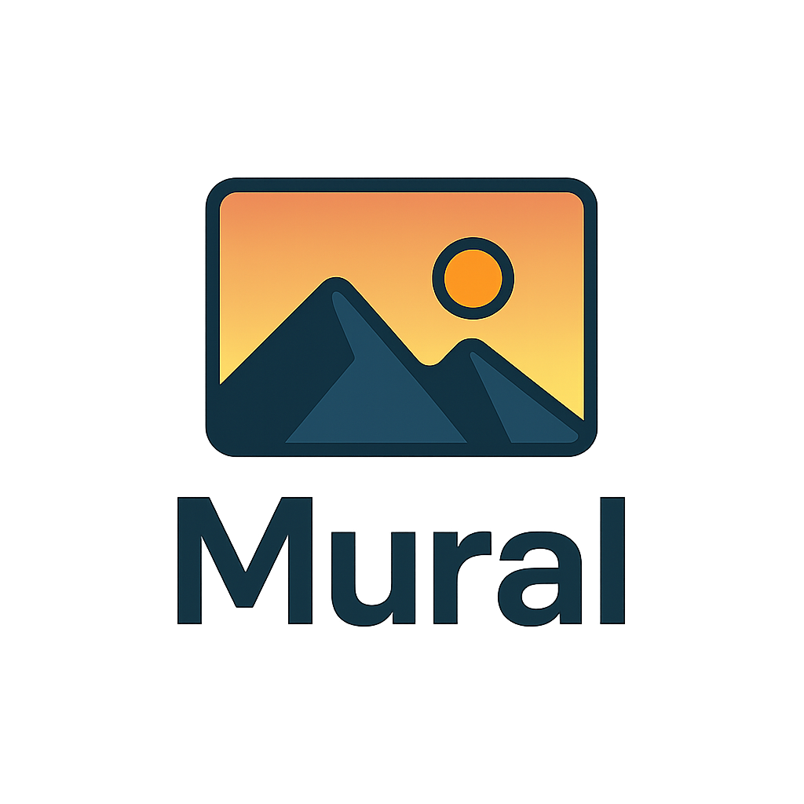

<p align="center">
  
</p>

A lightweight web app for displaying rotating wallpapers on your TV or large screen.  
Runs entirely in Docker with a Python (Flask) backend and a simple web-based slideshow frontend.
<p align="center">
  
</p>

## ✨ Features

- Fullscreen slideshow from a folder of wallpapers (`jpg`, `png`, `webp`, `gif` supported).
- Settings page to adjust:
  - Slide duration
  - Shuffle on/off
  - Fit mode: **cover** / **contain** / **actual size**
  - Sort order: by filename or last modified
  - Cursor auto-hide timeout
- On-screen overlay controls (auto-hide).
- Clock & date widget (with UK/24-hour format).
- Circular progress indicator showing time left for the current slide.
- Keyboard shortcuts:
  - `←` / `→` = Previous / Next
  - `Space` = Play / Pause
  - `F` = Fullscreen
- Daily refresh of the wallpaper list (no restart needed).
- Docker-ready and lightweight (runs with Gunicorn in a Python 3.12 slim image).

## 📦 Getting Started

### 1. Clone this repository

```bash
git clone https://github.com/Anishrkhadka/mural.git
cd mural
````

### 2. Build and run with Docker Compose

```bash
docker compose build
docker compose up -d
```

By default, the app runs on port **7200**.

Open in your browser / TV:

* Slideshow: [http://localhost:8000](http://localhost:7200)
* Settings: [http://localhost:8000/settings](http://localhost:7200/settings)

### 3. Add wallpapers

Drop your images into the `wallpapers/` folder (on the host).
They are mounted into the container at `/app/wallpapers`.
No restart required — Mural will refresh its image list daily, or you can refresh the page manually.

---

## ⚙️ Configuration

Persistent settings are stored in `data/settings.json` (auto-created on first save).
Available options:

```json
{
  "duration_seconds": 10,
  "shuffle": true,
  "fit_mode": "cover",
  "order_by": "name",
  "hide_cursor_after_ms": 3000,
  "preload_next": true
}
```

You can edit via the Settings page (`/settings`) or directly in the JSON file.

---

## 🗂️ Project Structure

```
mural/
  app.py                # Flask backend
  requirements.txt      # Python deps
  Dockerfile            # Container build
  docker-compose.yml    # Run config

  wallpapers/           # wallpapers (host-mounted)
  data/                 # Persisted settings.json

  templates/            # HTML templates
  static/               # JS, CSS, assets
```

---

## 🖥️ Deployment

Run on any device with Docker.
To access from your TV, open `http://<your_host_ip>:7200/` in the TV’s browser.

For autostart on boot:

```bash
docker compose up -d --restart=unless-stopped
```

## How to Use Mural – Workflow Overview

```mermaid
flowchart TD
  A[Start] --> B[Host **Mural**]
  B -->|Docker compose up| B1[Expose http://<host-ip>:8000]
  B1 --> C[Open Mural in browser to verify]

  subgraph CONTENT["Prepare Artwork"]
    D[Download art (e.g., from Artvee)] --> E[Organise into `wallpapers/`]
    E --> E1[Optional subfolders: `people`, `places`, `abstract`…]
  end

  C --> D
  E1 --> F[Refresh page or wait for daily auto-refresh]

  subgraph TV["TV Integration"]
    G[Install TVAppRepo APK] --> H[Create Web App Launcher]
    H --> I[Set Launcher URL → http://<host-ip>:8000/]
    I --> J[Optionally use Mural logo as app icon]
  end

  F --> G
  J --> K[Launch the Mural app on TV]

  subgraph USE["Usage & Customisation"]
    K --> L[Enter fullscreen (F or ⛶)]
    L --> M[Adjust settings at `/settings` (duration, shuffle, fit)]
    M --> N[Enjoy rotating wallpaper with clock & progress ring]
    N --> O[Add new images anytime; updated daily]
  end

  style CONTENT fill:#0b3a,stroke:#1b5,stroke-width:1px,color:#fff
  style TV fill:#2a2a,stroke:#555,stroke-width:1px,color:#fff
  style USE fill:#1a1a,stroke:#444,stroke-width:1px,color:#fff


## 📜 License

MIT License.
Created for personal use — enjoy your wallpapers in style ✨

